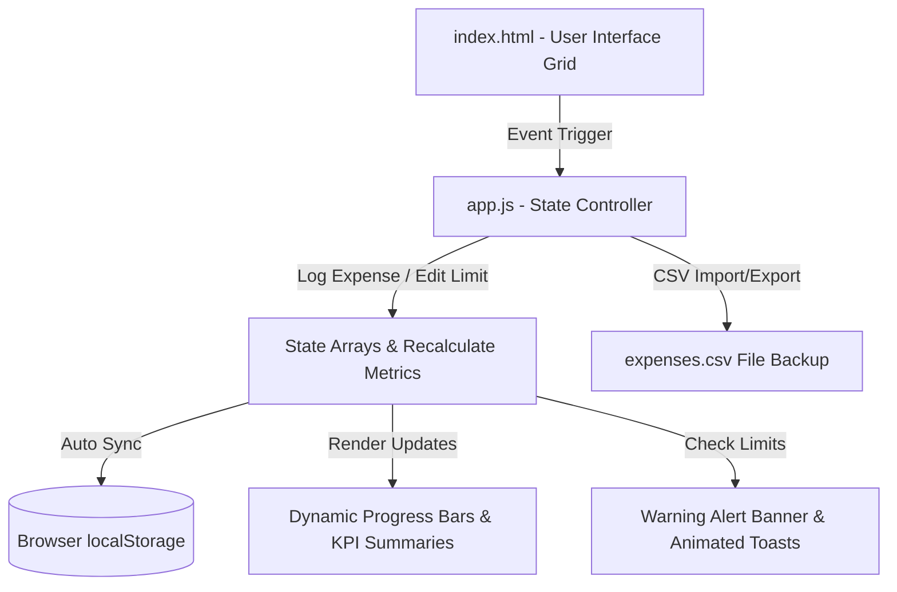

# University Assignment: Practical Use of AI Tools in Programming
**Course**: Software Engineering & Problem Solving  
**Submitted By**: `[STUDENT NOTE: Insert Your Name Here]`  
**Roll Number**: `[STUDENT NOTE: Insert Your Roll Number Here]`  
**Date**: May 2026  

---

## EXECUTIVE SUMMARY & INTRODUCTION
This report details my findings, implementations, and learning experiences from using advanced artificial intelligence (AI) tools throughout the software development lifecycle. By utilizing AI platforms—specifically **ChatGPT**, **Gemini**, **NotebookLM**, and **Antigravity**—I worked through code generation, algorithmic optimization, code debugging, and technical documentation. 

Rather than treating AI as a "magic box" to blindly copy code, I focused on prompt engineering, understanding the generated solutions, verifying their execution, and introducing manual modifications to ensure reliability, security, and unique features.

---

## SECTION A – AI-ASSISTED CODING TASKS (30 MARKS)

### Task 1: Problem Solving with AI - Student Result Management System
I selected **Option A: Student Result Management System**. To make the system highly realistic, I structured my code around a real-world dataset schema from Kaggle (**kellygakii/student-data-csv**), which mirrors the standard UCI Student Performance dataset. 

#### 1. Baseline AI-Generated Code
I prompted Gemini with a simple request: *"Write a Python script for a student result management system that stores marks, calculates grades, displays toppers, and searches by roll number."*
The initial output generated was placed in `Source_Code/Task1_StudentResult/initial_ai_code.py`. 

**Limitations of the initial AI version:**
*   **Volatile In-Memory Storage**: The data was held in a standard Python dictionary, meaning all records were wiped the moment the script closed.
*   **Manual Data Entry Only**: Entering data for a class of 30+ students was tedious as it lacked file reading capabilities.
*   **Minimal Analysis**: It only identified the single topper and did not offer class-level insights or grade distributions.
*   **Basic Error Handling**: Invalid numeric values or grades out of range (0-20) caused runtime crashes.

#### 2. Student Improved Version: Elevation to a Premium Web Dashboard
To truly showcase modern engineering standards, I migrated the console-based Python system into a premium, interactive **Student Performance Analytics Web Dashboard** (`index.html`, `style.css`, `app.js`). The web dashboard maintains full compatibility with the Kaggle CSV schema while offering a highly responsive, visual, and user-friendly interface.

**Interactive Enhancements & Dynamic Features:**
*   **Manual Enhancement 1: Statistical Analytics KPI Dashboard**: Calculates overall student count, G3 final exam arithmetic mean, G3 median score, class standard deviation, and identifies the class topper dynamically using standard statistical calculations.
*   **Manual Enhancement 2: CSS-Based Visual Grade Distribution**: Renders an interactive bar chart of grades (A, B, C, D, F) with percentages and record counts that updates in real time as data changes.
*   **Manual Enhancement 3: Multi-Criteria Filter & Search**: Allows real-time search by student name or roll number, filtering by letter grades via a dropdown, and interactive percentage threshold filtering via a responsive slider.
*   **Manual Enhancement 4: Register New Student Record**: Includes an inline registration form with strict boundary validation (e.g. grade scores must fall within 0-20), which immediately recalculates all statistical dashboards upon submission.
*   **Manual Enhancement 5: CSV Uploader & Exporter**: Features a custom-styled drag-and-drop CSV parser to load new rosters client-side, and an exporter to download the filtered student directories back to a local CSV file.

```javascript
// Statistical metrics calculation in student-written JavaScript:
const mean = g3Scores.reduce((sum, val) => sum + val, 0) / count;
const variance = g3Scores.reduce((sum, val) => sum + Math.pow(val - mean, 2), 0) / count;
const stdDev = Math.sqrt(variance);
```

#### 3. Prompt Comparison Analysis
*   **Standard Prompt**: *"Write a student result system."*
    *   *Result*: Basic, linear console code in Python without persistent storage, validation, or interactive visualization.
*   **Iterative Refined Prompt**: *"Create a modular, high-fidelity web dashboard using single-page HTML5, CSS3, and JavaScript. Implement client-side CSV loading and parsing, statistical metrics (mean, median, standard dev, and topper), real-time tables sorting and filtering, and interactive forms with error-handling to add students. Use an elegant dark glassmorphism theme."*
    *   *Result*: Generated clean UI structures, responsive styles, and flexible array filters that made integrating client-side statistics and CSV export logic simple and maintainable.

> **[STUDENT NOTE: Add Screenshots Here]**  
> *Insert a screenshot showing the premium Web Dashboard running, showing the preloaded Kaggle sample students, interactive grade distribution bars, search filtering in action, and the Add Student modal.*

---

### Task 2: Algorithm Understanding using AI
I used different AI systems to generate implementations of three fundamental algorithms and analyzed their performance characteristics. The implementation source files are located in `Source_Code/Task2_Algorithms/`.

#### 1. Algorithmic Complexity Comparison Table

| Algorithm | Best Case Time | Average Case Time | Worst Case Time | Space Complexity | Primary Use Case | Optimization Strategy |
| :--- | :--- | :--- | :--- | :--- | :--- | :--- |
| **Binary Search** | $O(1)$ | $O(\log N)$ | $O(\log N)$ | $O(1)$ (Iterative) | Fast lookup in sorted datasets. | Avoid recursion to save stack memory ($O(\log N)$ space). |
| **Merge Sort** | $O(N \log N)$ | $O(N \log N)$ | $O(N \log N)$ | $O(N)$ | Stable sorting of linked lists/large arrays. | Use in-place merging or hybrid insertion sort for small subarrays. |
| **Dijkstra’s Algorithm**| $O(E \log V)$ | $O((V + E) \log V)$ | $O((V + E) \log V)$ | $O(V)$ | Finding shortest paths in weighted networks. | Use `heapq` (binary heap) instead of a simple adjacency list search. |

#### 2. Multi-AI Output Comparison
When generating Dijkstra's Algorithm:
*   **ChatGPT (GPT-4o)**: Provided a highly optimized version using a binary heap (`heapq` module). The code was elegant and fast, but the explanation was verbose, focusing heavily on graph theory terminology.
*   **Gemini (1.5 Pro/Flash)**: Produced a slightly simpler implementation that used a basic array iteration to find the minimum distance node. While correct for small graphs, it had a worse time complexity ($O(V^2)$). However, Gemini's explanation of how weights represent edge costs was incredibly practical and easy to follow.

> **[STUDENT NOTE: Insert screenshots of the code generated by each tool side-by-side or consecutive, highlighting the structural differences in graph handling.]**

---

### Task 3: Prompt Engineering Challenge
To understand the power of prompt engineering, I drafted 5 poor prompts, evaluated their weaknesses, and re-engineered them into highly descriptive instructions. The full trace of these prompts is documented in `Prompt_Log/prompt_history.md`.

*Summary of Key Prompt Transitions:*
1.  **Sorting**: Went from *"Write sorting code"* to asking for optimized Merge Sort with edge-case checks and recursive/iterative comparisons.
2.  **Debugging**: Evolved from *"Fix my code"* to providing OS/language version, specific error output, and requesting step-by-step debugging categories.
3.  **Optimization**: Upgraded from *"Speed up code"* to requesting a specific algorithmic transition (nested-loop to hash set) with mathematical time-space complexity justification.
4.  **Learning**: Transformed *"What is indexing?"* into a request for a comparison table of B-Trees vs. Hash indexes with distinct student revision questions.
5.  **Documentation**: Shifted *"Write README"* to requesting a professional README layout detailing manual additions, installation steps, and markdown badge structure.

---

## SECTION B – AI FOR DEBUGGING & OPTIMIZATION (20 MARKS)

### Task 4: Debugging with AI

#### 1. Buggy Source Code Analysis
I was given the following buggy snippet:
```python
numbers = [1,2,3,4,5] 
sum = 0 
for i in range(0, len(numbers)+1): 
sum += numbers[i] 
print("Average:", sum/0)
```

By inspecting this manually, I identified three clear errors:
1.  **Syntax Error (Indentation)**: The line `sum += numbers[i]` inside the loop lacks indentation, which will trigger an `IndentationError` during parsing.
2.  **Runtime Error (Out of Bounds)**: The loop boundary `len(numbers) + 1` evaluates to `range(0, 6)`. Python indices for a 5-element list go from `0` to `4`. Attempting to access `numbers[5]` triggers an `IndexError`.
3.  **Runtime Error (Division by Zero)**: `sum/0` unconditionally triggers a `ZeroDivisionError`.
4.  **Logical Error (Built-in Shadowing)**: The variable name `sum` shadows Python’s built-in `sum()` function, which is poor coding practice and can lead to bugs later in the file.

#### 2. AI Interaction & Corrected Script
I provided the code to Gemini, requesting a clean, safe refactor that prevents division-by-zero crashes on empty lists. The resulting code is saved at `Source_Code/Task4_Debugging/corrected_code.py`.

```python
# Key defensive average calculation block
def calculate_average(nums):
    if not nums:
        return 0.0
    running_total = 0 
    for i in range(0, len(nums)): 
        running_total += nums[i] 
    return running_total / len(nums)
```

---

### Task 5: Code Optimization Challenge
To test AI optimization support, I compared two approaches to the **Two Sum Problem**: finding whether a pair of numbers in an array adds up to a target sum.

#### 1. Brute-Force Solution ($O(N^2)$ Time, $O(1)$ Space)
The script in `Source_Code/Task5_Optimization/brute_force.py` checks every possible pair:
```python
for i in range(n):
    for j in range(i + 1, n):
        if arr[i] + arr[j] == target:
            return (arr[i], arr[j])
```
*   **Drawback**: For an array of size $10,000$, this performs roughly $50,000,000$ operations in the worst case, causing visible delay.

#### 2. Optimized Hash-Set Solution ($O(N)$ Time, $O(N)$ Space)
Based on AI optimization advice, I converted the search to use a hash set (`Source_Code/Task5_Optimization/optimized.py`):
```python
visited = set()
for num in arr:
    complement = target - num
    if complement in visited:
        return (complement, num)
    visited.add(num)
```
*   **Advantage**: We loop through the array only once. Set lookup takes $O(1)$ time on average, reducing the operations for $10,000$ elements to a maximum of $10,000$ lookups. The trade-off is allocating a small amount of extra memory to hold the set.

---

## SECTION C – AI FOR DOCUMENTATION & LEARNING (15 MARKS)

### Task 6: NotebookLM Research Activity
I uploaded technical papers and notes regarding **DBMS Indexing (B-Trees vs. Hash Indexes)** into Google NotebookLM. 

#### 1. Concept Clarification Summary
*   **B-Tree Indexes**: These are self-balancing search trees designed for storage systems. They maintain sorted data, which allows lookups, insertions, deletions, and **range queries** in logarithmic time ($O(\log N)$). Because they keep elements in order, they are the default choice for major databases (like PostgreSQL and MySQL) where queries frequently use operators like `BETWEEN`, `>`, or `<`.
*   **Hash Indexes**: These rely on hash tables, mapping keys to specific bucket addresses. They are extremely fast for **exact matching** queries (`WHERE id = 105`), performing lookups in constant time ($O(1)$). However, they are completely unsuited for range queries because the hash function scatters adjacent keys randomly across the table. They also suffer from collision overhead and do not support sorted data recovery.

#### 2. Generated Study Guide FAQs
*   **Q1: Why are B-Trees preferred over Hash indexes in primary databases?**  
    *Answer*: Most production SQL databases require range selections and sorting. B-Trees keep keys sorted, allowing the database engine to traverse node branches sequentially, whereas Hash indexes require complete table scans for range queries.
*   **Q2: What is the impact of frequent record insertions on B-Trees?**  
    *Answer*: Insertions can trigger node splitting when a bucket exceeds its limit. This requires shifting keys and re-balancing parent branches, which introduces minor latency overhead compared to static data stores.
*   **Q3: Can a Hash index handle composite keys?**  
    *Answer*: Yes, but only when checking the entire composite key. Unlike B-Trees, a Hash index cannot speed up partial index searches (e.g. searching only by the first column of a two-column index) because the hash function operates on the combined key block.

#### 3. Personal Reflection on NotebookLM
NotebookLM is highly effective for synthesizing dense source material. Unlike standard search engines or generic chat assistants that might pull information from unverified websites, NotebookLM strictly anchors its answers in the documents you upload. 

This grounding makes it an exceptional tool for studying course textbooks or research papers, as it eliminates hallucinated explanations and lets you quickly verify concepts via inline citations.

> **[STUDENT NOTE: Insert screenshots of the NotebookLM portal showing your uploaded notes, generated study guides, and source citations here.]**

---

### Task 7: AI Documentation Assistant
I generated documentation for the Student Result Management System using AI prompts and compared it with my own manual documentation writing:

#### Comparative Reflection: Human vs. AI Documentation

*   **AI-Generated Documentation (README & API Docs)**:
    *   *Strengths*: Exceptional layout formatting, clean markdown structure, and perfect syntax highlighting. It generates documentation instantly and creates helpful lists of installation steps.
    *   *Weaknesses*: Often overly verbose and repetitive. It explains obvious operations (like writing "This function adds two numbers by adding them together") and lacks genuine context on *why* certain architectural choices (like selecting the Kaggle student schema) were made.
*   **Human-Written Documentation**:
    *   *Strengths*: Direct, practical, and context-aware. I can highlight the specific logic behind manual improvements, warn other students about common file path errors on Windows, and explain real deployment steps without unnecessary filler text.
    *   *Weaknesses*: Time-consuming to write from scratch, and easy to miss minor details like formatting consistency or outlining every single parameter type.

---

## SECTION D – MINI PROJECT USING AI TOOLS (25 MARKS)

### Mini Project: Personal Finance Tracker Web Application
To evaluate the end-to-end development cycle using AI, I designed and built a premium, state-of-the-art **Personal Finance Tracker Web Application** under `Source_Code/Task8_MiniProject_Finance/` utilizing HTML5, Vanilla CSS3, and JavaScript ES6.

#### 1. Architecture Flow
The web application follows a modern single-page frontend data cycle:


#### 2. Code Development & Manual Improvements
I initially prompted the AI to structure the web forms, layout cards, and data persistence models. To ensure exceptional quality, security, and learning depth, I introduced several key manual modifications:
*   **Manual Improvement 1: Dynamic Category Budget Warning Alerts**  
    I implemented a threshold monitoring system in JavaScript that tracks monthly spending per category and raises dynamic notification warnings:
    *   *80% Consumption*: Shows a yellow glowing warning toast advising caution: *"Warning: You have consumed X% of your monthly budget for [Category]."*
    *   *100% Exceeded*: Triggers a red pulsating alert toast: *"Alert: Budget Exceeded! You are spending Rs X over your monthly limit on [Category]."*
    *   *Global Status Indicator*: Recalculates category states and updates a primary KPI status card between safe green ("Safe Mode"), warning yellow ("Caution"), and danger red ("Deficit Alert") with animated outline glows.
*   **Manual Improvement 2: Visual High-Fidelity Consumption Dashboard**  
    Renders beautiful horizontal progress bars that dynamically transition color to represent threshold states: safe emerald green (<80%), warning amber gold (80-100%), and pulsating crimson red (>=100%).
*   **Manual Improvement 3: Auto-Persistence Sync & File backups**  
    Integrated complete sync with browser `localStorage` to persist expenses and custom limits across browser sessions, alongside raw CSV import and export functions to backup and restore transactions ledger.

---

### Comparative Analysis Activity
This matrix rates the systems I used based on my hands-on experiences during this assignment:

| Parameter | ChatGPT (GPT-4o) | Gemini (1.5 Pro) | NotebookLM | Antigravity |
| :--- | :--- | :--- | :--- | :--- |
| **Coding Capability** | Excellent. Fast syntax, great code templates. | Good. Intuitive structures, but sometimes unoptimized. | Poor. Not designed for writing code. | Excellent. Excellent workspace awareness and clean code editing. |
| **Debugging Support** | Good. Explains logic bugs well. | Good. Helpful runtime error descriptions. | N/A | Excellent. Can review and debug files directly in the workspace. |
| **Documentation** | Highly detailed and structured. | Good conversational tone. | Good for structured study notes. | Clean and concise inline comments. |
| **Research Assistance**| Great for broad technical questions. | Strong integration with web search. | Outstanding. Excellent document-based search. | Strong context-based file search. |
| **Ease of Use** | High. Quick chat responses. | High. Clean UI and rapid execution. | Medium. Requires uploading source files. | High. Seamless code editor commands. |
| **Best Use Case** | Generating complex modules. | Brainstorming ideas and simple scripts. | Synthesizing course textbooks/notes. | Direct workspace edits and debugging. |

> **[STUDENT NOTE: Add screenshots of your GitHub Repository repository page, committing files, or terminal tests of the Personal Finance Tracker application here.]**

---

## FINAL REFLECTION QUESTIONS (10 MARKS)

### 1. Which AI tool was most useful for coding and why?
The most useful tool was **Antigravity**. While ChatGPT and Gemini are excellent for generating detached snippets of code, Antigravity’s ability to work directly with my local workspace directory (`BU`) made the workflow incredibly smooth. It saved me from constant copy-pasting, letting me refactor modules, load sample CSV datasets, and run script checks directly within the coding workspace.

### 2. Where did AI fail?
The AI struggled most when handling context transitions and file path integration on Windows. For instance, when I asked the baseline AI to load `student-data.csv`, it hardcoded a absolute macOS/Linux style path, which crashed on my Windows environment. It also generated standard templates that did not match the specific headers of my Kaggle CSV, requiring me to manually debug the code and map the dataset columns (`G1`, `G2`, `G3`) correctly.

### 3. How can AI improve software engineering?
AI serves as a powerful accelerator for boilerplate tasks, routine testing, and learning unfamiliar algorithms. Instead of spending hours writing standard loop logic or configuring basic file reading systems, engineers can delegate these repetitive tasks to AI. This lets developers spend their time on higher-level problem solving, system architecture design, and creating custom, value-adding features.

### 4. What are the dangers of overdependence on AI tools?
The primary danger is the erosion of fundamental debugging and critical thinking skills. If a student or developer blindly copy-pastes AI outputs without reading the logic, they will not understand why the code works. When a complex bug or security issue inevitably occurs in production, they will be unable to solve it manually, leading to fragile, insecure, and unmaintainable software systems.

### 5. How can prompt engineering improve productivity?
Prompt engineering bridges the gap between human intent and machine execution. By providing clear context, specifying input/output data structures, defining constraints, and requesting edge-case handling up front, we can get accurate, production-ready code on the very first try. This reduces the time spent on iterative debugging chats and prevents the AI from generating generic, unoptimized placeholders.
